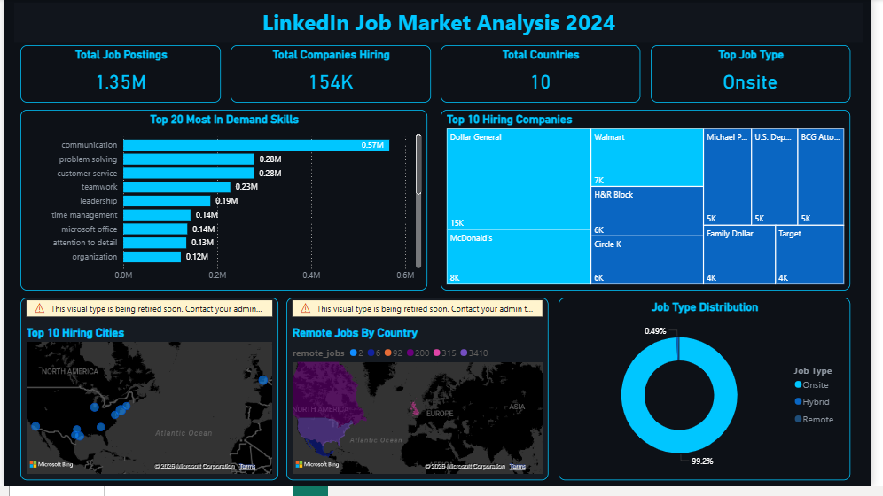
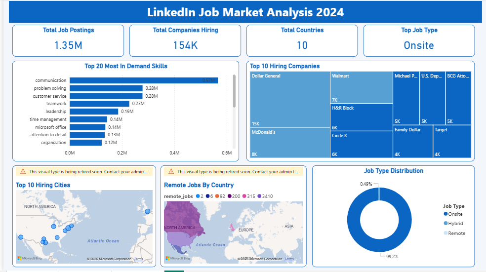

# LinkedIn Job Market Analysis 2024




## Project Overview

This project analyzes 1.3 million real LinkedIn job postings from 2024 to answer questions that matter to anyone entering the job market:

- What skills are companies actually hiring for right now?
- Which companies are posting the most jobs?
- Where are the jobs located geographically?
- How dominant is onsite work vs remote in reality?
- What is the split between entry level and senior roles?

The goal was to go beyond surface level stats and find insights that challenge common assumptions — like how remote work is far less common than the internet would have you believe.

---

## Tools Used

| Tool | Purpose |
|---|---|
| Python (Google Colab) | Data loading, cleaning, analysis, and CSV export |
| Pandas | Data manipulation and transformation |
| Power BI | Interactive dashboard with dark and light themes |

### Why SQL Was Not Used

The original plan included MySQL for data storage and querying. However the dataset contains 1.3 million rows across three files totalling several hundred MB. Loading this into a local MySQL instance via MySQL Workbench caused repeated failures including import wizard crashes, LOAD DATA INFILE access restriction errors, and row truncation errors from messy CSV formatting. Rather than force a tool that wasn't suited to the environment, the decision was made to handle all data operations directly in Python using pandas — which is exactly what most real world analysts do with large datasets anyway. The analysis questions that would have been answered in SQL were answered in Python instead, with no loss of insight.

---

## Dataset

**Source:** [1.3M LinkedIn Jobs & Skills 2024 — Kaggle](https://www.kaggle.com/datasets/asaniczka/1-3m-linkedin-jobs-and-skills-2024)

Three files:
- `linkedin_job_postings.csv` — 1,348,454 rows, 14 columns. Job title, company, location, level, type
- `job_skills.csv` — 1,296,381 rows. Skills required per job posting
- `job_summary.csv` — 1,297,332 rows. Full job description text (loaded but not used in final analysis)

All three files connect through the `job_link` column.

---

## Project Structure

```
linkedin_analysis/
│
├── linkedin_job_analysis.ipynb          # Main analysis notebook
├── top_jobs.csv              # Top 10 most posted job titles
├── top_companies.csv         # Top 10 companies before cleaning
├── top_companies_clean.csv   # Top 10 companies after removing aggregators
├── job_type_dist.csv         # Remote vs Onsite vs Hybrid distribution
├── job_level_dist.csv        # Associate vs Mid Senior distribution
├── top_skills.csv            # Top 20 most in demand skills
├── top_countries.csv         # Top 10 countries by job postings
├── top_cities.csv            # Top 10 cities by job postings
├── remote_by_country.csv     # Remote job count by country
├── job_level_type.csv        # Job level vs job type breakdown
└── README.md
```

---

## Key Findings

**1. Communication is the most in demand skill by far**
With 566,097 mentions across job postings, communication beats every technical skill. Problem solving (278k) and customer service (278k) follow. Data analysis appears at 81,964 — in the top 20 out of every skill across 1.3 million postings.

**2. Remote work is not the norm**
99.2% of all job postings are onsite. Only 4,259 jobs (0.32%) are remote. The narrative that remote work is mainstream does not hold up when you look at actual hiring data across all industries.

**3. Job aggregators inflate company hiring numbers**
The top hiring "companies" by raw posting count are actually job boards — Health eCareers (41,598 posts), Jobs for Humanity (27,680), TravelNurseSource (16,142). After filtering these out the real top employers are Dollar General, McDonald's, Walmart and H&R Block — all high volume hourly employers.

**4. Healthcare dominates the job market**
Three of the top five posting entities are healthcare focused platforms. Nursing appears as a top 15 most demanded skill. Healthcare is clearly the largest hiring sector in this dataset.

**5. 89% of roles are mid senior level**
Only 10.68% of postings are associate level — the entry point for fresh graduates. That is still 144,009 jobs, but competition is real. Associate level roles skew heavily onsite (141,655 onsite vs 865 remote).

**6. New York leads all cities**
New York tops hiring cities at 15,810 postings, followed by London (12,454) and Houston (11,062). The United States accounts for 83% of all postings in the dataset.

**7. Same skills listed under different names**
A significant data quality issue was discovered — skills like "Communication", "Communication skills" and "Communication Skills" were treated as separate entries. After standardization the true counts changed significantly. This is the kind of issue that makes real world data unreliable without proper cleaning.

---

## Challenges and How They Were Solved

**Challenge 1 - Kaggle API setup**
The standard Kaggle token download did not work in the browser. Solved by manually creating the `kaggle.json` credentials file directly in Colab using Python's json library.

**Challenge 2 - Colab session kept crashing**
Loading 1.3 million rows into Colab repeatedly caused RAM crashes. Solved by using `dtype='category'` for text columns which dramatically reduced memory usage, and by processing the skills file in chunks of 50,000 rows at a time using Python's Counter instead of loading everything at once.

**Challenge 3 - Duplicate skill names**
The skills column had the same skill listed in multiple formats — different capitalizations, spacing, and merged words (e.g. "Problemsolving" vs "Problem solving"). Solved by converting all skills to lowercase, stripping extra whitespace, and using a standardization dictionary to merge known duplicates.

**Challenge 4 - US states appearing as countries**
Extracting the last part of a location like "New York, NY" gave "NY" not "United States". Solved by building a lookup list of all 50 US state abbreviations and replacing matches with "United States".

**Challenge 5 - Job aggregators inflating company data**
Companies like Health eCareers, TravelNurseSource and ClearanceJobs are job boards not actual employers. They were posting tens of thousands of jobs on behalf of real companies. Solved by building an exclusion list and filtering them out before analysis.

**Challenge 6 - Metropolitan area labels in location data**
LinkedIn uses regional labels like "New York City Metropolitan Area" and "Greater Houston" as locations. These were appearing in country and city analysis. Solved using `str.contains()` with pattern matching to filter them out.

**Challenge 7 - Power BI map visual retirement**
The built-in Map visual in Power BI showed a retirement warning during dashboard building. Attempted to replace with Azure Maps but the visual was not available in the environment. Kept the existing map visuals as they still functioned correctly for the analysis.

---

## Dashboard

Built in Power BI with two themes:

**Dark Theme** - futuristic dark navy with electric cyan accents (`#0D1117` background, `#00C6FF` accents)

**Light Theme** - clean professional white with LinkedIn blue (`#F3F6FB` background, `#0A66C2` accents)

### Visuals included:
- 4 KPI cards - Total Job Postings, Total Companies Hiring, Total Countries, Top Job Type
- Top 20 Most In Demand Skills - horizontal bar chart
- Top 10 Hiring Companies - treemap
- Top 10 Hiring Cities - map visual
- Remote Jobs By Country - filled map
- Job Type Distribution - donut chart

---

## How to Run

1. Open the notebook `linkedin_job_analysis.ipynb` in Google Colab
2. Replace the Kaggle credentials in Cell 1 with your own username and API key
3. Run all cells in order
4. Download the generated CSV files
5. Open Power BI Desktop and load the CSV files
6. Rebuild the dashboard or use the provided `.pbix` file

---

## What I Learned

- How to handle large datasets in memory constrained environments using chunked processing and optimized data types
- Real world data is never clean — the same information appears in dozens of formats and standardization is a core analyst skill
- Job aggregators and platform artifacts can completely distort analysis if not identified and removed
- Power BI measures using DAX can solve problems that simple field aggregations cannot
- Building two dashboard themes shows attention to design and presentation, not just data

---

## Author

**Rott** — Aspiring Data Analyst & Data Scientist

Dataset credit: [asaniczka on Kaggle](https://www.kaggle.com/datasets/asaniczka/1-3m-linkedin-jobs-and-skills-2024)
